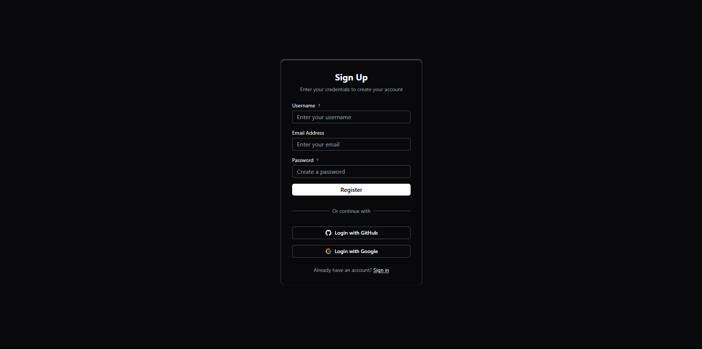
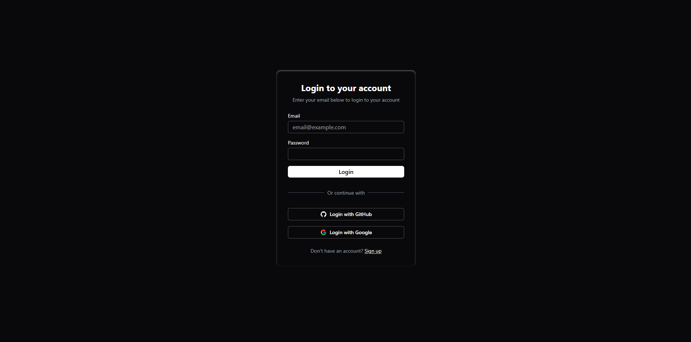

# Workspace App 🚀

An interactive, fully containerized workspace application featuring productivity and communication tools with **Docker support** for seamless development and deployment.


## Table of Contents

1. [Overview](#overview)
2. [Tech Stack](#tech-stack)
3. [Features](#features)
4. [Screenshots](#screenshots)
5. [Requirements](#requirements)
6. [Quick Start with Docker](#quick-start-with-docker)
7. [Manual Installation](#manual-installation)
8. [Configuration](#configuration)
9. [Usage](#usage)
10. [Docker Commands](#docker-commands)
11. [Future Enhancements](#future-enhancements)
12. [Authors](#authors)
13. [License](#license)

## Overview

This application provides a convenient "workspace" environment where users can switch between various tools and customize the interface to their needs. Built as a **full-stack containerized application** with development and production Docker environments.

**🔥 Key Highlights:**

- **Full Docker Support** - Development & Production environments
- **Hot Reload** - Live code updates in development
- **Microservices Architecture** - Separate containers for frontend, backend, database, and cache
- **Production Ready** - Nginx reverse proxy, security headers, SSL ready

## Tech Stack

### **Backend**

- **Go 1.24** + Gin framework
- **WebSocket** communication for real-time chat
- **MySQL 8.0** database with health checks
- **Redis 7** for caching and sessions
- **JWT** cookies + OAuth (GitHub, Google)
- **Docker** with CompileDaemon for hot reload

### **Frontend**

- **Next.js 14** with TypeScript
- **React 18** + Redux Toolkit for state management
- **Tailwind CSS** for responsive styling
- **Supabase** for file storage
- **Docker** with live reload support

### **Infrastructure**

- **Docker Compose** - Multi-container orchestration
- **Nginx** - Reverse proxy (production)
- **Custom Networks** - Container communication
- **Volumes** - Data persistence

## Features

### 🎯 **Workspace Tools**

- **TODO List** - Task management with persistence
- **Pomodoro Timer** - Configurable work/break intervals
- **Calculator** - Full-featured calculator widget
- **Video Player** - YouTube integration
- **Paint Tool** - Drawing with pen, shadows, fill patterns, transforms

### 💬 **Real-time Chat Hub**

- **WebSocket Communication** - Instant messaging
- **User ID System** - Connect via unique identifiers

### 🎨 **Customization**

- **6 Video Backgrounds** - Tokyo, Forest, Swiss and more..
- **Opacity Control** - Adjust widget transparency
- **Audio Environment** - Rain sounds, UI feedback
- **Theme Switching** - Light/Dark modes
- **Fullscreen Mode** - Distraction-free experience

### ⚡ **Productivity Features**

- **Focus Mode** - Auto-hide UI after set time
- **Drag & Drop** - Repositionable widgets
- **Resize Widgets** - Customizable layout
- **Screen Restrictions** - Boundary management

### 📊 **Analytics**

- **Streak Tracking** - Consecutive usage days
- **Visit Statistics** - Total and current streaks
- **Progress Monitoring** - Personal productivity metrics

### 🔐 **Authentication**

- **Email/Password** - Traditional signup/login
- **OAuth Integration** - GitHub & Google sign-in
- **Email Verification** - Secure account creation
- **Account Management** - Profile updates, deletion

## Screenshots

1. **Main Workspace**
   

2. **Registration**
   

3. **Login Page**
   

## Requirements

### For Docker (Recommended)

- **Docker** ≥ 20.10
- **Docker Compose** ≥ 2.0
- **Git** for cloning

### For Manual Setup

- **Go** ≥ 1.24
- **Node.js** ≥ 24
- **MySQL** ≥ 8.0
- **Redis** ≥ 7.0

## Quick Start with Docker 🐳

### 1. **Clone the Repository**

```bash
git clone https://github.com/zshstacks/workspace_go.git
cd workspace_go
```

### 2. **Set Up Environment**

```bash
# Copy the environment template
cp .env.dev.example .env.dev

# Edit .env.dev with your actual values
# Replace all placeholder values with real secrets
```

### 3. **Start Development Environment**

```bash
# Start all services (database, redis, backend, frontend)
docker-compose -f docker-compose.dev.yml --env-file .env.dev up --build

# Or start in background
docker-compose -f docker-compose.dev.yml --env-file .env.dev up --build -d
```

### 4. **Access the Application**

- **Frontend**: http://localhost:3000
- **Backend API**: http://localhost:8000
- **Database**: localhost:3307

That's it! 🎉 The application is now running with hot reload enabled.

## Manual Installation

<details>
<summary>Click to expand manual setup instructions</summary>

### 1. **Backend Setup**

```bash
cd server
go mod download

# Start MySQL and Redis services locally
# Create database: pomodoro_go

# Run the application
go run main.go
# Or with hot reload: CompileDaemon -command="./server"
```

### 2. **Frontend Setup**

```bash
cd client
npm install
npm run dev
```

### 3. **Database Setup**

```sql
CREATE DATABASE pomodoro_go;
-- Your Go application will handle table creation
```

</details>

## Configuration

### **Environment Variables**

Copy `.env.dev.example` to `.env.dev` and configure:

```bash
# Database
DB_ROOT_PASSWORD=your_root_password
DB_USER=pomodorouser
DB_PASSWORD=your_db_password

# JWT Secrets (use strong random strings)
SECRET=your_jwt_secret_minimum_32_characters
REFRESH_SECRET=your_refresh_secret_minimum_32_characters

# Redis password
REDIS_PASS=change_this_redis_password

# URLs
FRONTEND_URL=http://localhost:3000
NEXT_PUBLIC_API_URL=http://localhost:8000

# OAuth Credentials
GITHUB_CLIENT_ID=your_github_client_id
GITHUB_CLIENT_SECRET=your_github_client_secret
GOOGLE_CLIENT_ID=your_google_client_id
GOOGLE_CLIENT_SECRET=your_google_client_secret

# Email Configuration
EMAIL_PASS=your_gmail_app_password
SMTP_HOST=smtp.gmail.com
SMTP_PORT=587

# Supabase links and storage keys
NEXT_PUBLIC_LOCAL_STORAGE_KEY=widgetPosition
NEXT_PUBLIC_LOCAL_STORAGE_KEY_BG=wrksFeatures
NEXT_PUBLIC_LOCAL_STORAGE_KEY_MEDIA=savedPlaylist
NEXT_PUBLIC_LOCAL_STORAGE_KEY_OPACITY=widgetOpacity
NEXT_PUBLIC_API_URL="http://localhost:8000"

NEXT_PUBLIC_START_PAUSE_AUDIO="supabase_url"
NEXT_PUBLIC_RAIN_AUDIO="supabase_url"
NEXT_PUBLIC_CLICK_AUDIO="supabase_url"
NEXT_PUBLIC_TWINKLE_AUDIO="supabase_url"
NEXT_PUBLIC_ALARM_AUDIO="supabase_url"

NEXT_PUBLIC_TOKYO_PREVIEW="supabase_url"
NEXT_PUBLIC_FOREST_PREVIEW="supabase_url"
NEXT_PUBLIC_SWISS_PREVIEW="supabase_url"
NEXT_PUBLIC_SPACE_PREVIEW="supabase_url"
NEXT_PUBLIC_TOKYO_SKY_PREVIEW="supabase_url"
NEXT_PUBLIC_SHIBUYA_PREVIEW="supabase_url"
```

### **OAuth Setup**

1. **GitHub**: [Developer Settings](https://github.com/settings/developers)
2. **Google**: [Cloud Console](https://console.cloud.google.com/)
3. Set redirect URLs to: `http://localhost:8000/auth/{provider}/callback`

## Usage

1. **Access**: Open http://localhost:3000
2. **Register**: Create account with email verification
3. **Login**: Use email/password or OAuth
4. **Customize**: Adjust themes, backgrounds, opacity
5. **Focus**: Enable focus mode for productivity
6. **Chat**: Connect with others using user IDs
7. **Track**: Monitor your productivity statistics

## Docker Commands

### **Development**

```bash
# Start development environment
docker-compose -f docker-compose.dev.yml --env-file .env.dev up --build

# Stop services
docker-compose -f docker-compose.dev.yml down

# View logs
docker-compose -f docker-compose.dev.yml logs -f
docker-compose -f docker-compose.dev.yml logs -f backend
docker-compose -f docker-compose.dev.yml logs -f frontend

# Restart specific service
docker-compose -f docker-compose.dev.yml restart backend

# Clean up
docker system prune -f
```

### **Production**

```bash
# Set up production environment
cp .env.dev.example .env.prod
# Edit .env.prod with production values

# Start production (with Nginx)
docker-compose -f docker-compose.prod.yml --env-file .env.prod up --build -d

# Stop production
docker-compose -f docker-compose.prod.yml down
```

## Architecture

```
┌─── Nginx (Production) ───┐
│   ├── Frontend (Next.js) │
│   └── Backend (Go/Gin)   │
└───────────────────────────┘
            │
    ┌───────┴───────┐
    │   Services    │
    ├── MySQL 8.0   │
    └── Redis 7     │
```

## Future Enhancements

- [ ] **Kubernetes Deployment** - Scale to multiple nodes
- [ ] **CI/CD Pipeline** - Automated testing and deployment
- [ ] **Monitoring** - Prometheus + Grafana integration
- [ ] **SSL/TLS** - Production HTTPS support
- [ ] **Load Balancing** - Multiple backend instances
- [ ] **File Uploads** - Enhanced Supabase integration
- [ ] **Mobile App** - React Native companion
- [ ] **Team Workspaces** - Collaborative features

## Contributing

1. Fork the repository
2. Create a feature branch: `git checkout -b feature/amazing-feature`
3. Make your changes and test with Docker
4. Commit: `git commit -m 'Add amazing feature'`
5. Push: `git push origin feature/amazing-feature`
6. Create a Pull Request

## Authors

- **@zshstacks** - _Full Stack Development & DevOps_

## License

This project is licensed under the MIT License - see the [LICENSE](LICENSE) file for details.

---

<div align="center">

**Built with ❤️ using Go, Next.js, and Docker**

[🌟 Star this repo](https://github.com/zshstacks/workspace_go) | [🐛 Report Bug](https://github.com/zshstacks/workspace_go/issues) | [💡 Request Feature](https://github.com/zshstacks/workspace_go/issues)

</div>
