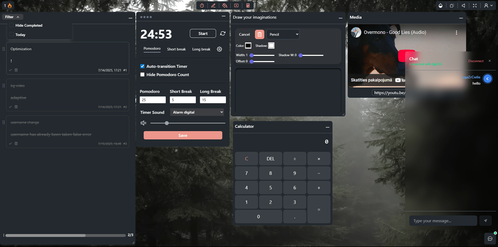

# Workspace App

An interactive, fully web-based “workspace” application featuring productivity and communication tools.

---

## Table of Contents

1. [Overview](#overview)
2. [Tech Stack](#tech-stack)
3. [Features](#features)
4. [Screenshots](#screenshots)
5. [Requirements](#requirements)
6. [Installation & Setup](#installation--setup)
7. [Configuration](#configuration)
8. [Usage](#usage)
9. [Future Enhancements](#future-enhancements)
10. [Authors](#authors)
11. [License](#license)

---

## Overview

This application provides a convenient “workspace” environment where users can switch between various tools and customize the interface to their needs. The backend is built with Go (Gin, WebSocket, MySQL, Redis, JWT cookie, OAuth) and the frontend uses Next.js, React, TypeScript, Redux, Supabase and Tailwind CSS.

---

## Tech Stack

- **Backend**

  - Go + Gin framework
  - WebSocket communication
  - MySQL database
  - Redis caching
  - Authentication: JWT cookies, OAuth (GitHub, Google)

- **Frontend**
  - Next.js
  - React + TypeScript
  - Redux for state management
  - Tailwind CSS for styling
  - Supabase storage

---

## Features

1. **Workspace**

   - Five main widgets:
     - TODO list
     - Pomodoro timer with configurable durations
     - Calculator
     - Video player (YouTube)
     - Paint tool (pen, width, shadow, shadow radius, fill pattern)

2. **Chat Hub**

   - Real-time chat via WebSocket
   - Join a conversation by entering another user’s unique ID

3. **Appearance Customization**

   - Choose from 6 video backgrounds
   - Adjust widget opacity
   - Toggle rain sound on/off
   - Fullscreen mode
   - Light and dark themes

4. **Focus Mode**

   - Header hides for a set duration
   - User-configurable focus time (in seconds)

5. **Statistics**

   - Longest streak of consecutive days
   - Total visit days

6. **Account Management**

   - Change username
   - Logout or delete account
   - View unique user ID

7. **Authentication**
   - Email/password login
   - Social login (GitHub, Google)
   - Signup with email confirmation code

---

## Screenshots

1. **Main Workspace**  
   

2. **Statistics Modal**  
   

3. **Login Page**  
   

---

## Requirements

- Go ≥ 1.20
- Node.js ≥ 16
- MySQL
- Redis

---

## Installation & Setup

1. **Backend**

   ```bash
   cd backend
   go mod download
   go run main.go   //or CompileDaemon -command="./server"

   ```

2. **Frontend**
   ```bash
   cd client
   npm install
   npm run dev
   ```

## Configuration

- Create a .env file in the backend directory:

  ```env
  PORT=8000
  DB="login:password@tcp(127.0.0.1:3306)/db_name?charset=utf8mb4&parseTime=True&loc=Local"
  SECRET=your_secret
  REFRESH_SECRET=your_secret

  FRONTEND_URL=http://localhost:3000

  REDIS_ADDR=localhost:6379
  REDIS_PASS=redis_pass

  EMAIL_PASS=your_pass
  SMTP_HOST=smtp.gmail.com
  SMTP_PORT=587

  GITHUB_CLIENT_ID=your_id
  GITHUB_CLIENT_SECRET=your_secret
  GITHUB_REDIRECT_URL=http://localhost:8000/auth/github/callback

  GOOGLE_CLIENT_ID=your_id
  GOOGLE_CLIENT_SECRET=your_secret
  GOOGLE_REDIRECT_URL=http://localhost:8000/auth/google/callback

  ```

- Create a .env file in the frontend directory:

  ```env
  NEXT_PUBLIC_LOCAL_STORAGE_KEY=widgetPosition
  NEXT_PUBLIC_LOCAL_STORAGE_KEY_BG=wrksFeatures
  NEXT_PUBLIC_LOCAL_STORAGE_KEY_MEDIA=savedPlaylist
  NEXT_PUBLIC_LOCAL_STORAGE_KEY_OPACITY=widgetOpacity
  NEXT_PUBLIC_API_URL="http://localhost:8000"

  NEXT_PUBLIC_START_PAUSE_AUDIO="supabase_url"
  NEXT_PUBLIC_RAIN_AUDIO="supabase_url"
  NEXT_PUBLIC_CLICK_AUDIO="supabase_url"
  NEXT_PUBLIC_TWINKLE_AUDIO="supabase_url"
  NEXT_PUBLIC_ALARM_AUDIO="supabase_url"

  NEXT_PUBLIC_TOKYO_PREVIEW="supabase_url"
  NEXT_PUBLIC_FOREST_PREVIEW="supabase_url"
  NEXT_PUBLIC_SWISS_PREVIEW="supabase_url"
  NEXT_PUBLIC_SPACE_PREVIEW="supabase_url"
  NEXT_PUBLIC_TOKYO_SKY_PREVIEW="supabase_url"
  NEXT_PUBLIC_SHIBUYA_PREVIEW="supabase_url"
  ```

## Usage

1.  Open your browser to http://localhost:3000

2.  Sign up or log in

3.  Use the workspace and customize it to your preference

4.  Enter Focus Mode when you need to concentrate

5.  Check your Statistics to track progress

## Authors

- [@zshstacks](https://www.github.com/zshstacks)

## License

[MIT](https://choosealicense.com/licenses/mit/)
